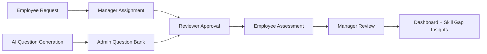
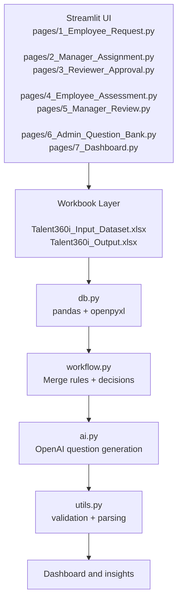

# Talent 360

<p align="center">
  
  
  
  
</p>

Talent 360 is a governed, AI-assisted employee capability assessment workflow built in Streamlit. It transforms employee requests into structured assessments, manager review cycles, skills calibration, and actionable training recommendations using workbooks as the operational data layer.

The canonical source is the project root: `app.py`, `pages/`, and the shared Python modules. The older SQLite-oriented modules and legacy seed/validation files are not the active workflow contract unless explicitly migrated.

## Overview



### Core capabilities

- Guided assessment lifecycle from employee request to skill calibration
- Role-based blueprint and question selection
- Human-in-the-loop SME review before assignment
- AI-generated assessment questions with governance controls
- Scored evaluation with critical-failure logic
- Training and skill-gap recommendations surfaced in a dashboard

## Architecture



### Active system components

- **UI:** Streamlit pages under `pages/`
- **Reference data:** `Talent360i_Input_Dataset.xlsx`, loaded read-only with pandas
- **Application data:** `Talent360i_Output.xlsx`, created as a copy of the input workbook on first write
- **Workbook access:** `db.py` reads and writes individual tabs with pandas and openpyxl
- **Workflow logic:** `workflow.py` merges input question data with latest output review decisions
- **AI generation:** `ai.py` calls OpenAI and expects JSON multiple-choice questions
- **Validation:** `utils.py` parses and validates generated questions

The input workbook must include the reference tabs used by the app, including:
`Users_Teams`, `Role_Master`, `Role_Skill_Map`, `Proficiency_Levels`, `Assessment_Blueprints`, `Assessment_Schedules`, `Assessment_QBank`, `Assessment_Results`, `User_Skill_Assessments`, `Skill_Gaps_TNI`, and `Training_Skill_Map`.

## End-to-end workflow

### 1) Employee Request

Page: `pages/1_Employee_Request.py`

- Select a seeded user, role-mapped skill, and target proficiency level
- Append an `Assessment_Requests` row with status `Requested`
- Append the request event to `App_Audit_Log`

### 2) Manager Assignment

Page: `pages/2_Manager_Assignment.py`

- Select a blueprint for the employee's role
- Find approved questions for the selected blueprint and requested skill
- Select five questions and create `Assessment_Assignments` and `Assessment_Assignment_Questions` rows
- Change request status to `Assigned`
- Use the first available schedule, preferring `Ready to Schedule`

### 3) Reviewer Approval

Page: `pages/3_Reviewer_Approval.py`

- Review pending questions individually
- Record approval in `SME_Review_Workflow` with reviewer role, decision, review date, and completion status
- Only questions with effective status `Approved` and `approved_for_schedule == Yes` are assignable

### 4) Employee Assessment

Page: `pages/4_Employee_Assessment.py`

- Select an employee and an incomplete assignment
- Answer only the assigned questions
- Record each response in `Assessment_Responses`
- Calculate score percentage and critical-question failure
- Write an `Assessment_Results` row with status `Scored` and mark the assignment `Completed`

### 5) Manager Review

Page: `pages/5_Manager_Review.py`

- Review scored results and propose a calibrated proficiency level
- Validate evidence and record SME signoff before changing result status to `Calibrated`
- Bound the final calibration to one level above or below the objective recommendation
- Write `User_Skill_Assessments` and `Skill_Gaps_TNI` using the role target level and `Training_Skill_Map`

### 6) Admin Question Bank

Page: `pages/6_Admin_Question_Bank.py`

- Generate ten questions for a role, blueprint, skill, and target level
- Save each generated question to `Assessment_QBank` as `Pending SME Review` with `approved_for_schedule == No`
- Require reviewer approval before assignment is possible
- Show valid approved coverage and difficulty mix for each blueprint and skill

### 7) Talent Dashboard

Page: `pages/7_Dashboard.py`

- Combine reference and application-created results, skill assessments, and gaps
- Show assessment counts, scored or calibrated results, skill levels, high gaps, and training recommendations
- Generate an optional AI portfolio summary from aggregated scores, outcomes, skill gaps, and course signals

## Decision and scoring rules

- `score_pct` = percentage of assigned questions answered correctly
- Pass threshold = `75%`
- A question with `critical_flag == Yes` answered incorrectly sets `critical_fail_flag` to `Yes` and fails the assessment regardless of percentage
- Recommendation logic uses workbook proficiency bands: `0`, `1`, `2`, `3`, `4`, and `5`
- A critical failure forces `Fail` and lowers a high recommendation before calibration
- Approved critical questions are schedulable; under the active `auto_fail` policy, an incorrect critical answer fails the assessment
- Manager calibration requires validated evidence and SME signoff, and is limited to one level above or below the objective recommendation
- Failed assessments can be sent back by the manager for reassessment; the original result remains preserved for audit
- A five-question assignment must include at least one Easy, one Medium, and one Hard question
- Ten-question AI banks request a 3 Easy / 4 Medium / 3 Hard distribution; SME approval status controls whether the mix is assignment-ready

## Output workbook tabs

The app creates or updates these tabs in `Talent360i_Output.xlsx`:

- `Assessment_Requests`
- `Assessment_Assignments`
- `Assessment_Assignment_Questions`
- `Assessment_Responses`
- `Assessment_Results`
- `SME_Review_Workflow`
- `User_Skill_Assessments`
- `Skill_Gaps_TNI`
- `App_Audit_Log`

## Project structure

```text
Talent360/
├── app.py
├── ai.py
├── db.py
├── workflow.py
├── utils.py
├── validate.py
├── seed.py
├── models.py
├── services.py
├── theme.py
├── README.md
├── requirements.txt
├── pages/
│   ├── 1_Employee_Request.py
│   ├── 2_Manager_Assignment.py
│   ├── 3_Reviewer_Approval.py
│   ├── 4_Employee_Assessment.py
│   ├── 5_Manager_Review.py
│   ├── 6_Admin_Question_Bank.py
│   ├── 7_Dashboard.py
│   ├── 8_Architecture.py
│   └── 9_Data_Map.py
├── tools/
│   └── compile_check.py
├── .env.example (if used locally)
└── Talent360i_Input_Dataset.xlsx
```

## Running locally

Place the input workbook in the project directory, then run:

```powershell
.\.venv\Scripts\Activate.ps1
streamlit run app.py
```

Open the local Streamlit URL, usually:

```text
http://localhost:8501
```

For AI question generation, create a `.env` file with:

```text
OPENAI_API_KEY=your-openai-api-key
```

The configured model is `gpt-4` and the prompt version is `v2`. Never commit `.env`, API keys, or generated output workbooks containing sensitive data.

## Demo walkthrough

1. Start the app and open `1. Employee Request`.
2. Select a seeded user, mapped skill, and target level; submit the request.
3. If fewer than five approved questions exist, use `6. Admin Question Bank` to generate ten questions.
4. Open `3. Reviewer Approval` and approve at least five suitable questions.
5. Open `2. Manager Assignment`, choose a blueprint, select five questions, and assign the assessment.
6. Open `4. Employee Assessment`, select the user and assignment, answer every question, and submit.
7. Open `5. Manager Review`, choose the calibrated level, and confirm it.
8. Open `7. Dashboard` to inspect results, skill gaps, and training recommendations.

## Validation and legacy notes

Run the syntax check:

```bash
python -m py_compile app.py db.py workflow.py ai.py utils.py pages/*.py
```

Legacy files such as `validate.py`, `seed.py`, `models.py`, and `services.py` contain older SQLite or separate-workbook assumptions and should not be treated as the active workflow contract without review.

The current pages do not yet implement duplicate-request prevention, evidence capture, expiry enforcement, question-bank rejection, manager send-back, or study-plan persistence.

## Why this app matters

Talent 360 helps organizations move from ad hoc skill reviews to a more structured, auditable talent operating model. It aligns employee capability signals with manager judgment, SME review, and data-backed development recommendations without losing the human decision layer that makes talent management credible.
